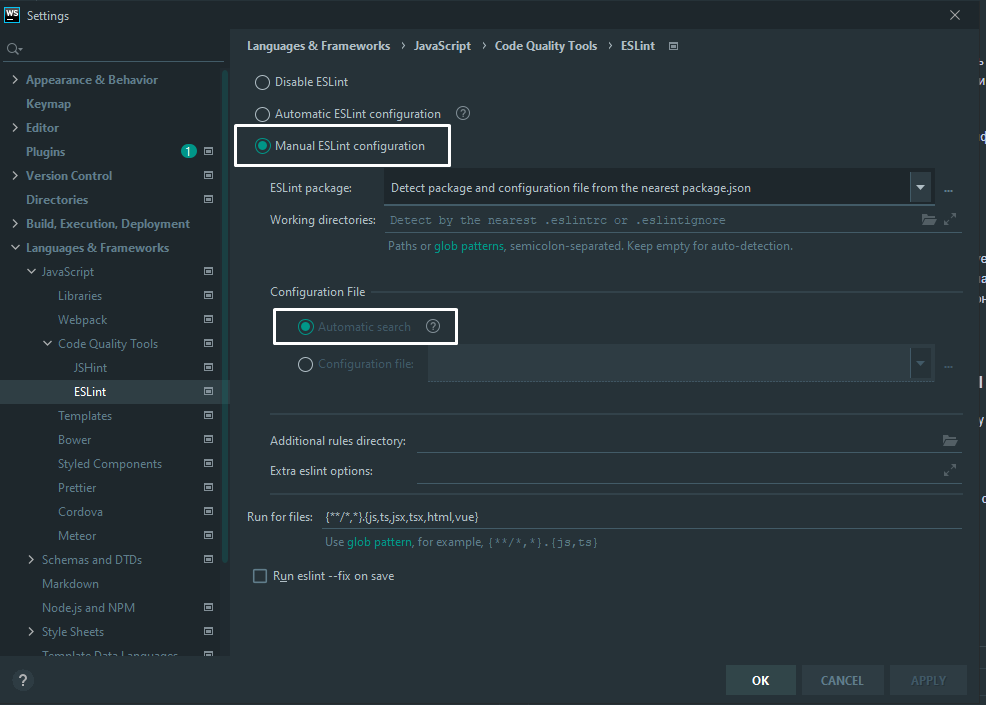
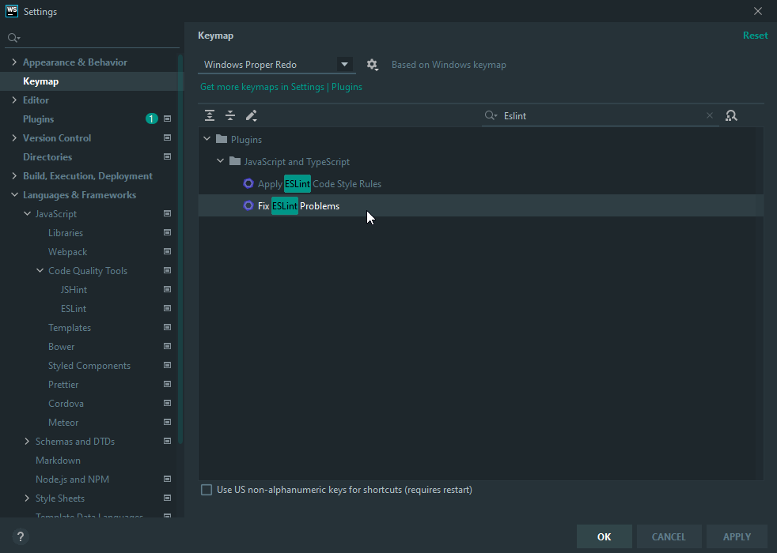
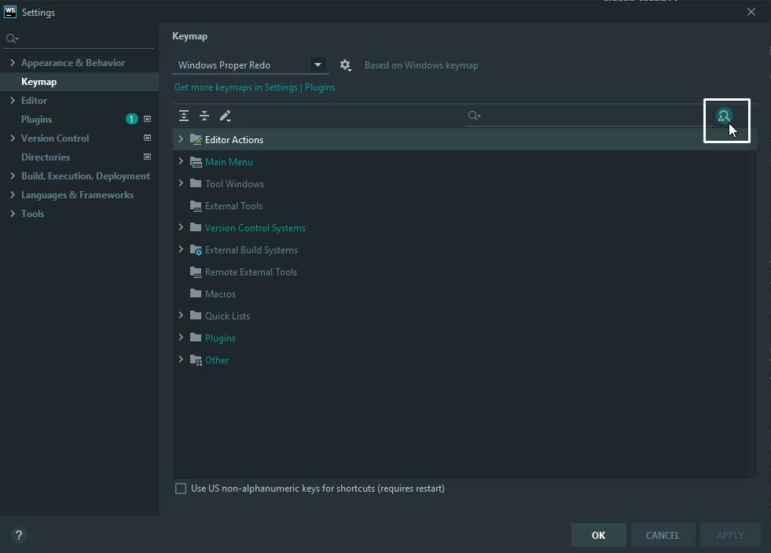
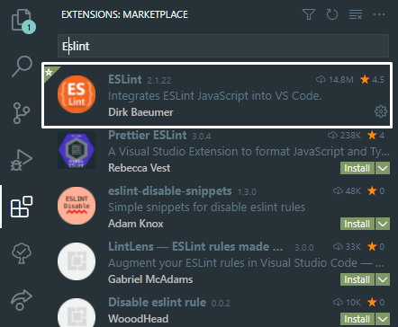
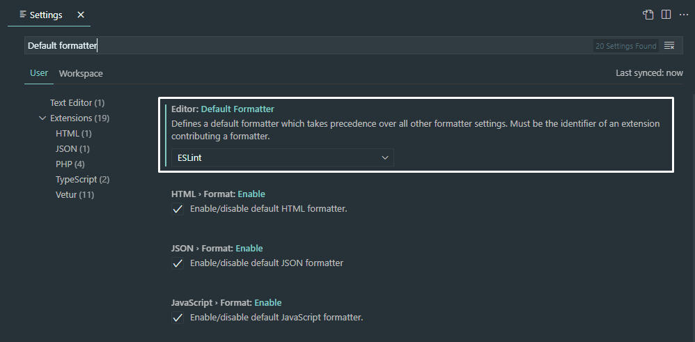

## Зачем 
Для того чтобы унифицировать стиль написания кода, легче замечать ошибки 
и не париться о форматировании ибо для Webstorm и VSCode предусмотрены
возможности автоматического форматирования.

Если хотите дополнить/изменить конфиг, вперед, давайте обсуждать,
ибо на данный момент по сути это просто конфиг airbnb.

## Установка

- В первую очередь инициализируем проект с помощью `npm init`.
- После установим сам ESLint командой `npm install --save-dev eslint`
- Теперь нам нужен конфигурационный файл. Просто возьмите его из данного
  репозитория и закиньте в корень проекта.

## Проверка ошибок и форматирование

Тут дорожки слегка расходятся, ибо у Webstorm и VSCode слегка разные пути.

### Webstorm

В первую очередь надо дать понять, откуда брать конфиг, для этого
зайдем в `Settings -> Languages & Frameworks -> JavaScript -> Code Quality Tools -> ESLint`
и установим переключатели в положение как на скриншоте ниже.

Перейдем к автоформатированию.
Во все тех же настройках переходим в `Settings -> Keymap `, в строке поиска пишем "Eslint" и
кликаем по пункту Fix ESLint problems. После выбираем сочетание клавиш, по нажатию которого
файлы проекта будут автоматически отформатированы (у меня `Alt+Shift+F`).

Также после этого советую проверить, нет ли на выбранное Вами сочетание
установленных ранее действий. Для этого кликните на иконку в правом верхнем углу
и нажмите нужное сочетание. Вам выдаст список всех действий, установленных на это сочетание.

### VSCode

Переходим на вкладку расширений и в поиске пишем "Eslint".
Выбираем первый вариант и устанавливаем.

Далее нам надо установить ESLint как форматтер по умолчанию.
Для этого в настройках находим пункт Default Formatter и в выпадающем меню выбираем ESLint.

После чего можем отформатировать файл нажав сочетание клавиш `Alt+Shift+F`.
